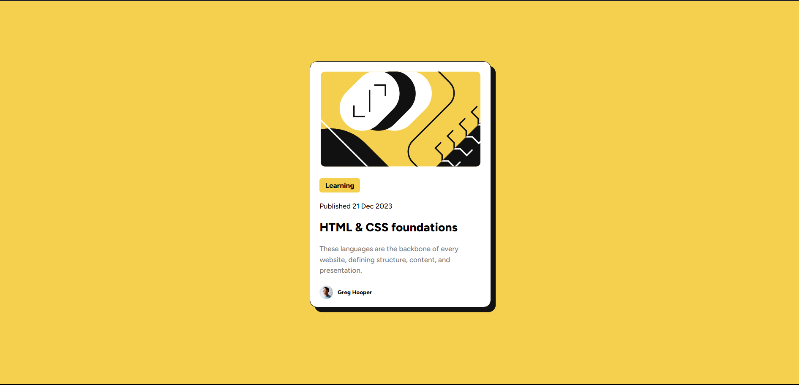

# Frontend Mentor - Blog preview card solution

This is a solution to the [Blog preview card challenge on Frontend Mentor](https://www.frontendmentor.io/challenges/blog-preview-card-ckPaj01IcS). Frontend Mentor challenges help you improve your coding skills by building realistic projects. 

## Table of contents

- [Overview](#overview)
  - [The challenge](#the-challenge)
  - [Screenshot](#screenshot)
  - [Links](#links)
- [My process](#my-process)
  - [Built with](#built-with)
  - [What I learned](#what-i-learned)
  - [Continued development](#continued-development)
  - [Useful resources](#useful-resources)
- [Author](#author)
- [Acknowledgments](#acknowledgments)


## Overview

### The challenge

Users should be able to:

- See hover and focus states for all interactive elements on the page

### Screenshot




### Links

<!-- - Solution URL: [Add solution URL here](https://your-solution-url.com) -->
- Live Site URL: [Live Site URL](https://blog-preview-eta-sepia.vercel.app/)

## My process

### Built with

- HTML
- CSS 
- Flexbox


### What I learned

Building up from the previous QR project [QR Component Project](https://github.com/alifrachmat2002/Frontend-Mentor-Projects/tree/master/QR), I continued learning about Flexbox, especially `justify-content`,`align-items` property of the flexbox. I also learned to apply pseudo-class, that is the `active` pseudo-class to change the appearance of the Blog Preview Component when it is clicked. I also learned to use the `box-shadow` to further decorate the Blog Preview Component. 

this is how i applied flexbox in my [code](./style.css) to stack the elements of the Blog Preview Component top to bottom and the `box-shadow` to add the shadow behind the Blog Preview Component.
```css
.blog-preview {
    margin: 25vh;
    /* HERE */
    display: flex;
    flex-direction: column;
    align-items: center;
    /* HERE */
    background-color: #fff;
    width: 380px;
    height: 516px;
    border: 1.4px solid hsl(0, 0%, 7%);
    border-radius: 15px;
    box-shadow: 10px 10px hsla(0, 0%, 7%, 1);
}
```

this is how i applied the `active` pseudo-class to change the appearance of the Blog Preview Component when it is clicked.
```css
.blog-preview:active, .blog-preview:hover {
    box-shadow: 15px 15px hsla(0, 0%, 7%, 1);
}

.blog-preview:active .title, .blog-preview:hover .title {
    color: hsl(47, 88%, 63%);
}
```

### Useful resources

- [Learn Flexbox in 15 Minutes](https://www.youtube.com/watch?v=fYq5PXgSsbE&t=153s) - This Helped me understand Flexbox to layout different elements of my page according to my desire.

## Author

- LinkedIn - [Alif Rachmat Illahi](https://www.linkedin.com/in/alifrachmat/)
- GitHub - [@alifrachmat2002](https://github.com/alifrachmat2002)
- Frontend Mentor - [@alifrachmat2002](https://www.frontendmentor.io/profile/alifrachmat2002)
