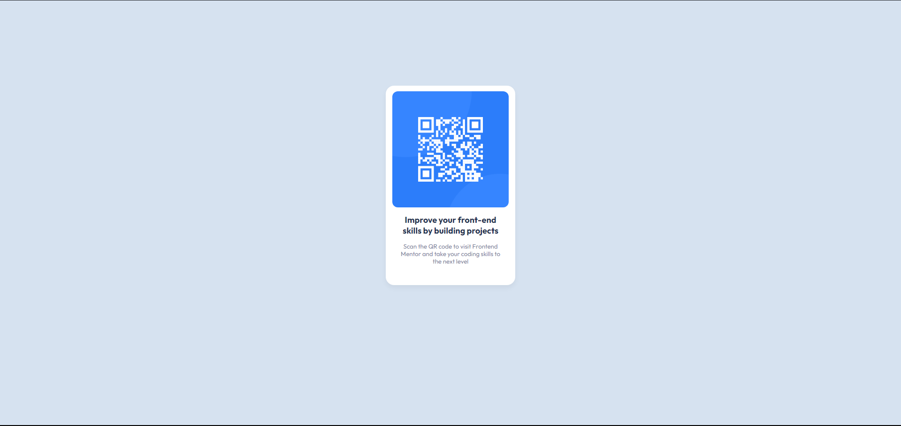

# Frontend Mentor - QR code component solution

This is a solution to the [QR code component challenge on Frontend Mentor](https://www.frontendmentor.io/challenges/qr-code-component-iux_sIO_H). Frontend Mentor challenges help you improve your coding skills by building realistic projects. 

## Table of contents

- [Overview](#overview)
  - [Screenshot](#screenshot)
  - [Links](#links)
- [My process](#my-process)
  - [Built with](#built-with)
  - [What I learned](#what-i-learned)
- [Author](#author)
- [Acknowledgments](#acknowledgments)

## Overview

### Screenshot




### Links

<!-- - Solution URL: [Add solution URL here](https://your-solution-url.com) -->
- [Live Site URL](https://frontendmentor-qr-component-pink.vercel.app/) 

## My process

### Built with

- HTML
- CSS 
- Flexbox

### What I learned

I Learned how to practically apply CSS to create a component of a website. I used the flexbox feature to adjust the layout of my component to my desire. I also style the fonts, colors, and the background of the page.

I learned a lot about flexbox and how to actually use it, and it's actually pretty simple, as simple as this part of the code
```css
body{
    background-color: hsl(212, 45%, 89%);
    display: flex;
    justify-content: center;
    /* align-items: center; */
}
```


## Author

- LinkedIn - [Alif Rachmat Illahi](https://www.linkedin.com/in/alifrachmat/)
- GitHub - [@alifrachmat2002](https://github.com/alifrachmat2002)
- Frontend Mentor - [@alifrachmat2002](https://www.frontendmentor.io/profile/alifrachmat2002)

## Acknowledgments

- [Nadhif Lazuardi](https://github.com/nadhiflazuardi)


