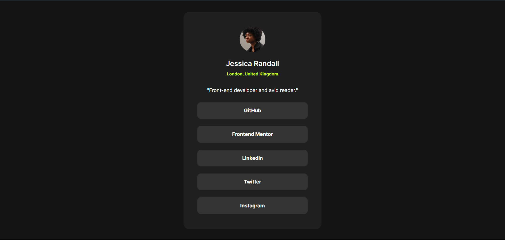

# Frontend Mentor - Social links profile solution

This is a solution to the [Social links profile challenge on Frontend Mentor](https://www.frontendmentor.io/challenges/social-links-profile-UG32l9m6dQ). Frontend Mentor challenges help you improve your coding skills by building realistic projects. 

## Table of contents

- [Overview](#overview)
  - [The challenge](#the-challenge)
  - [Screenshot](#screenshot)
  - [Links](#links)
- [My process](#my-process)
  - [Built with](#built-with)
  - [What I learned](#what-i-learned)
  - [Continued development](#continued-development)
  - [Useful resources](#useful-resources)
- [Author](#author)
- [Acknowledgments](#acknowledgments)

**Note: Delete this note and update the table of contents based on what sections you keep.**

## Overview

### The challenge

Users should be able to:

- See hover and focus states for all interactive elements on the page

### Screenshot



### Links

- [Live Site URL](https://social-profile-eta.vercel.app/))

## My process

### Built with


- HTML
- CSS 
- Flexbox

### What I learned

Building up from the previous challenge, the [Blog Preview](), I continue learning about CSS FLexbox, and i've finally found a proper way to place my div (elements) in the center of the screen using the `main` tag :D. I also applied more hover animations using the `:hover` pseudo-class. I also learned how to create some button, by *NOT* using the `button` tag. here's some snippets of my code 

Here's how i used `main` to place center my div (elements)
```css
main {
    min-height: 100vh;
    display: flex;
    justify-content: center;
    align-items: center;
}
```

and here's how i create my buttons and use `:hover` to animate my buttons
```html
<div class="contact-container">
  <a href="https://github.com/alifrachmat2002" target="_blank"><p class="contact-card">GitHub</p>
  </a>
  <!--rest of the code-->
</div>
```
```css
.contact-card {
    background-color: hsl(0, 0%, 20%);
    padding: 15px;
    border-radius: 10px;
    font-weight: 700;
    transition: 0.2s ease;
    /* border: 1px solid white;  */
}

.contact-card:hover {
    background-color:  hsl(75, 94%, 57%);
    color: hsl(0, 0%, 8%);
}
```


## Author

- LinkedIn - [Alif Rachmat Illahi](https://www.linkedin.com/in/alifrachmat/)
- GitHub - [@alifrachmat2002](https://github.com/alifrachmat2002)
- Frontend Mentor - [@alifrachmat2002](https://www.frontendmentor.io/profile/alifrachmat2002)

